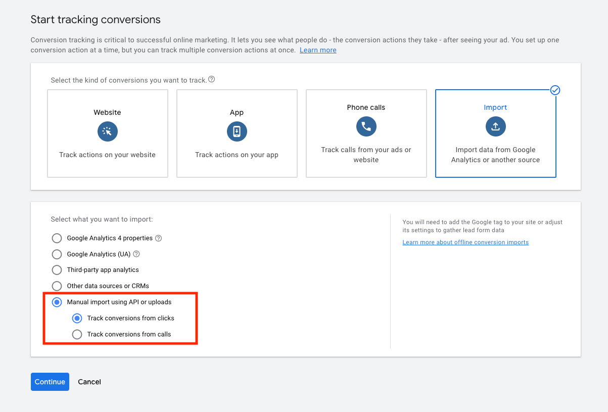

!!!beta "This feature is in Closed Beta"

    This feature is in Closed Beta and is in active development. Contact your Amplitude Client Success Manager for support with this integration.

Amplitude Data's Google Ads integration enables you to stream your Amplitude event data straight to Google Ads with just a few clicks.

## Considerations

- You must enable this integration in each Amplitude project you want to use it in.
- Amplitude sends custom events using Amplitude `event_type` as event name.
- This integration uses Amplitude's integration uses Google Ads [Upload Click Conversions API](https://developers.google.com/google-ads/api/docs/conversions/upload-clicks). This would mean the event payload needs both the Google Click ID (`gclid`) and the Conversion Date Time properties. Google Ads relies on the `gclid` parameter to track user interactions with ads and attribute conversions back to specific ad clicks. When a user clicks an ad served through Google Ads, Google Ads generates a unique `gclid` value and appends it to the URL. This parameter identifies the click, and links it to subsequent conversions. Amplitude drops events without a user property `gclid`.
- Note that `gclid` needs to be valid and not `none` and Conversion Date Time filed should be of the `format yyyy-MM-dd HH:mm:ss` with optional micro of seconds. For example the `event_time` that's part of the default mapped property will have the format `2024-02-23 19:18:32.712000`.
  
## Setup

### Amplitude setup

1. In Amplitude Data, click **Catalog** and select the **Destinations** tab.
2. In the Event Streaming section, click **Google Ads**.
3. Enter a sync name, then click **Create Sync**.

After you create the destination, you must configure the settings.

#### Configure settings

1. On the **Settings** tab, click **Edit**.
2. Under **Status**, click the toggle from **Disabled** to **Enabled**.
3. Upload your [**Google Cloud Service Account**](https://developers.google.com/google-ads/api/docs/oauth/service-accounts): A Google Cloud Service Account, is a special type of Google account used for server-to-server interactions and authentication within Google Cloud Platform (GCP) services. You will need to upload the google cloud service account via a JSON file. This will be created by the user who has access to the Google Ads Service Account. Please note that the Google Ads Service Account should have [domain wide delegation enabled](https://developers.google.com/workspace/guides/create-credentials). When setting up the domain wide delegation, the oAuth scope would be https://www.googleapis.com/auth/adwords. Additional details can be found [here](https://developers.google.com/google-ads/api/docs/get-started/oauth-cloud-project#configure_the_oauth_consent_screen).
4. Enter your **Google Cloud Service Account User Email:** This is the email address of the user who created the Google Cloud Service Account and who has access to the Google Ads Account.
5. Enter your **Google Ads Developer Token:** The Google Ads admin needs to apply for a [developer token](https://developers.google.com/google-ads/api/docs/get-started/dev-token) from the Manager account. Each level of the [developer token has limits](https://developers.google.com/google-ads/api/docs/access-levels#access_levels) on the number of requests that can be sent from Amplitude.
6. Enter your [**Google Ads Customer ID**](https://support.google.com/google-ads/answer/1704344?hl=en). A Google Ads Customer ID is a unique identifier assigned to each advertiser or business that uses Google Ads. This ID helps Google track and manage accounts, campaigns, and billing information for advertisers. The Google Ads Customer ID can be found on the top right when logged into Google Ads. Please note that the hypens -  should NOT be entered. i.e. Just paste in the value without the hyphens.
7. Enter your [**Google Ads Conversion Action ID**](https://support.google.com/google-ads/thread/105330243?hl=en&sjid=5504033552721490234-EU). This is a unique identifier associated with a specific conversion action in Google Ads, and represents a desired action that you want your visitors or users to take. For example, make a purchase, submit a contact form, or sign up for a newsletter. Once the conversion action is created on Google Ads, visit the details page (path: /conversions/detail) by clicking on it and the url has a parameter `&ctId=****`. Copy that parameter as that represents the Google Ads Conversion Action ID.
8. Configure **Send Events** to send events ingested by Amplitude to Google Ads. 
      1. To send events, toggle **Send Events** to **Enabled**.
      2. Expand the **Select and filter events** panel, and select which events to send. Amplitude recommends that you send only the events you need in Google Ads, rather than selecting **All Events**.
9. Map your Amplitude property to Google Ads property
      1. Map the **gclid** Amplitude property to the **GCLID** property in Google Ads
      2. Map the **event_time** Amplitude property to the **Conversion Date Time** property in Google Ads
10. Save when finished.

### Setup Tracking Conversion in Google Ads

When setting up Tracking Conversions on Google Ads, you will need to pick the following option from the Google Ads UI. This will allow the offline conversions to be recorded in Google Ads in the `Goals` section of Google Ads. Please note, there is some delay on Google Ads and there may be delays of up to 60 minutes for the metrics to show up after events are streamed from Amplitude.

   

## Common issues

### Stuck at the authentication step

If you see `ERR_BLOCKED_BY_CLIENT` in your browser's console, disable your ad blocker, clear your browser's cache and cookies, and try to add the connection again.

### "Error: Invalid Customer ID"

Google Ads requires a **Customer ID** to configure as an integration with Amplitude. For more information, see [Find your Google Ads customer ID](https://support.google.com/google-ads/answer/1704344?hl=en) in Google's documentation. Keep in mind, **Manager Account Customer ID** is different from the **Customer ID**.

### Insufficient permissions

Amplitude's Google Ads Event Streaming integration requires that your Google Ads Manager account has administrator privileges. This level of permission allows Amplitude to add and remove users from specific user lists in Google Ads.
For Google Ads, Amplitude adds and removes users from a specific user list. As a result, Amplitude needs appropriate permissions to create and delete Google Ads account data.
For more information, see [About access levels in your Google Ads Account
](https://support.google.com/google-ads/answer/9978556) in Google's documentation.

## Use Cases

1. **Enhanced Conversion Tracking:** By linking Amplitude events to Google Ads, you can track conversions more effectively. This is particularly useful for understanding how users who click on your Google Ads interact with your product or service. For instance, if a user clicks an ad and then completes a significant action (like signing up or making a purchase) tracked in Amplitude, this integration allows you to attribute that action back to the specific ad click.
2. **Data-Driven Advertising Decisions:** The integration helps in making more informed decisions about your advertising strategies. By analyzing which ads lead to meaningful user actions, you can optimize ad spend, focusing on the most effective campaigns and channels.
