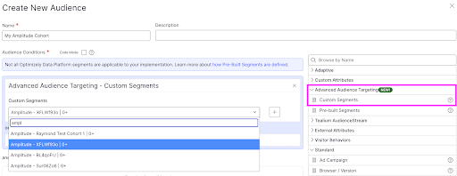
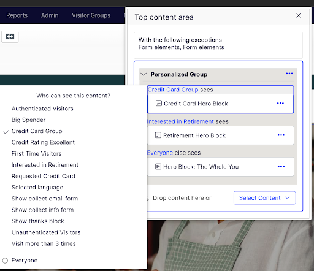

!!!Tip

    This integration is maintained by Optimizely. Contact the Optimizely support team for support with this integration. 

[Optimizely](https://www.optimizely.com/) allows advertisers to access a wide range of digital advertising inventory, including display ads, video ads, mobile ads, native ads, and more. Advertisers can use the platform to target specific audiences based on various parameters such as demographics, interests, browsing behavior, and location. The platform also offers real-time bidding capabilities, allowing advertisers to bid on ad placements in real-time auctions.

The Amplitude Behavioral Cohort Optimizely destination  connects your Amplitude Cohorts to Optimizely Experimentation audiences (Web and Feature experimentation) and Optimizely CMS Visitor Groups. This allows you to target your cohorts with experiments and personalized website experiences leveraging your valuable Amplitude data. 

## Considerations

- This integration is only available for customers who have paid plans with Amplitude.
- You must enable this integration in each Amplitude project you want to use it in.
- This integration requires a paid Optimizely plan.

## Setup

### Optimizely setup

1. Within your Optimizely Data Platform environment navigate to the app directory via the ‘boxes and +’ icon in the top right.
2. Click the **Amplitude** tile at the top and click **Install** in the top left.
3. Once installed, navigate to the **Settings** tab, click **Generate Token**, and copy the resulting token to your clipboard.

### Amplitude setup

1. In Amplitude Data, click **Catalog** and select the **Destinations** tab.
2. In the Cohort section, click **Optimizely**.
3. Click **Add another destination**.
4. Enter **Name** and paste in the **Bearer Token** you copied from **Optimizely**.
5. Map the Amplitude **User ID** field to the Optimizely User ID field. Note the **User ID** you select must be the same **User ID** you’re targeting with experimentation and/or visitor groups. 
6. Save when finished.

## Send a cohort

To sync your first cohort, follow these steps:

1. In Amplitude, open the cohort you want to sync, then click **Sync**.
2. Select **Optimizely**, then click **Next**.
3. Choose the account you want to sync to.
4. Choose the sync cadence.
5. When finished, save your work.

## Locating your cohort in Optimizely

1. First, ensure your CMS Visitor Groups and/or Advanced Audience Targeting Experimentation integration(s) are configured. Here are relevant instructions for the one-time setup: 
 
    - [CMS Visitor Groups](https://nuget.optimizely.com/package/?id=UNRVLD.ODP.VisitorGroups)
    - [Advanced Audience Targeting Web Experimentation](https://docs.developers.optimizely.com/web-experimentation/docs/configure-odp-audience-targeting#configure-advanced-audience-targeting)
    - [Advanced Audience Targeting Feature Experimentation](https://docs.developers.optimizely.com/feature-experimentation/docs/advanced-audience-targeting#implement-the-advanced-audience-targeting-integration)
  
2. Once you’ve completed the above you will find your Synced Amplitude Behavioral cohorts in the CMS Visitor Groups UI as well as the Experimentation Audience Builder. See below

### Use cases

- **Personalized Push Notifications:** By utilizing Amplitude's data insights, you can create personalized user experiences in Optimizely. Amplitude helps identify specific user cohorts with unique behaviors and preferences. This information allows you to tailor experiments and variations to deliver personalized content, product recommendations, and user interface adjustments to these segments. The result is enhanced user engagement and satisfaction, translating into higher conversion rates.
- **Behavior-Based Experimentation:** Behavior-based experimentation is key to optimizing user journeys and conversions. Amplitude's data helps pinpoint user behaviors that significantly impact engagement. By sending this data to Optimizely, you can create experiments targeting users with these behaviors. For example, you can run experiments to reduce cart abandonment rates, improve onboarding processes, or optimize product recommendations based on user behavior. This approach leads to a more effective user experience and increased conversion rates.
- **Conversion Rate Optimization (CRO):** To maximize revenue and user satisfaction, it's crucial to identify and address drop-off points using Amplitude's data. By sending cohorts of users who drop off at specific stages to Optimizely, you can run targeted experiments. These experiments may involve optimizing the user interface, revising content, or enhancing functionality where users tend to abandon their journeys. The outcome is a proactive approach to conversion challenges, resulting in increased conversion rates, improved revenue, and smoother user journeys.
