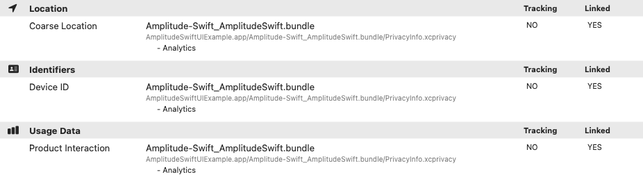

This is the official documentation for the Amplitude Analytics iOS SDK.

!!!info "iOS SDK Resources"
    [:material-github: GitHub](https://github.com/amplitude/Amplitude-Swift) · [:material-code-tags-check: Releases](https://github.com/amplitude/Amplitude-Swift/releases) · [:material-book: Examples](https://github.com/amplitude/Amplitude-Swift/tree/main/Examples/AmplitudeSwiftUIExample)

--8<-- "includes/sdk-ios/apple-deprecate-carrier.md"

--8<-- "includes/size/ios.md"
    `./measure_cocoapod_size.py --cocoapods AmplitudeSwift:1.0.0`.

!!! info "Minimum versions"
    For the minimum supported platform versions of this package, see [`Package.swift`](https://github.com/amplitude/Amplitude-Swift/blob/main/Package.swift#L8-L12) on GitHub.

## Getting started

Use [this quickstart guide](../../sdks/sdk-quickstart#ios) to get started with Amplitude iOS SDK.

## Usage

### Initialize

You must initialize the SDK before you can instrument. The API key for your Amplitude project is required.

=== "Swift"

    ```swift
    let amplitude = Amplitude(configuration: Configuration(
        apiKey: AMPLITUDE_API_KEY
    ))
    ```

=== "Objective-C"

    ```obj-c
    AMPConfiguration* configuration = [AMPConfiguration initWithApiKey:AMPLITUDE_API_KEY];
    Amplitude* amplitude = [Amplitude initWithConfiguration:configuration];
    ```

### `Configuration`

???config "Configuration Options"
    | <div class="big-column">Name</div>  | Description | Default Value |
    | --- | --- | --- |
    | `apiKey` | The apiKey of your project. | `nil` |
    | `instanceName` | The name of the instance. Instances with the same name will share storage and identity. For isolated storage and identity use a unique `instanceName` for each instance. | "default_instance" |
    | `storageProvider` | Implements a custom `storageProvider` class from `Storage`. Not supported in Objective-C. | `PersistentStorage` |
    | `logLevel` | The log level enums: `LogLevelEnum.OFF`, `LogLevelEnum.ERROR`, `LogLevelEnum.WARN`, `LogLevelEnum.LOG`, `LogLevelEnum.DEBUG` | `LogLevelEnum.WARN` | 
    | `loggerProvider` | Implements a custom `loggerProvider` class from the Logger, and pass it in the configuration during the initialization to help with collecting any error messages from the SDK in a production environment. | `ConsoleLogger` |
    | `flushIntervalMillis` | The amount of time SDK will attempt to upload the unsent events to the server or reach `flushQueueSize` threshold. | `30000` |
    | `flushQueueSize` | SDK will attempt to upload once unsent event count exceeds the event upload threshold or reach `flushIntervalMillis` interval.  | `30` |
    | `flushMaxRetries` | Maximum retry times.  | `5` |
    | `minIdLength` | The minimum length for user id or device id. | `5` |
    | `partnerId` | The partner id for partner integration. | `nil` |
    | `identifyBatchIntervalMillis` | The amount of time SDK will attempt to batch intercepted identify events. | `30000` |
    | `flushEventsOnClose` | Flushing of unsent events on app close. | `true` |
    | `callback` | Callback function after event sent. | `nil` |
    | `optOut` | Opt the user out of tracking. | `false` |
    | `defaultTracking` | Enable tracking of [default events](#tracking-default-events) for sessions, app lifecycle, screen views, and deep links. | `DefaultTrackingOptions(sessions: true)` |
    | `minTimeBetweenSessionsMillis` | The amount of time for session timeout. | `300000` |
    | `serverUrl` | The server url events upload to. | `https://api2.amplitude.com/2/httpapi` |
    | `serverZone` |  The server zone to send to, will adjust server url based on this config. | `US` |
    | `useBatch` |  Whether to use batch api. | `false` |
    | `trackingOptions` |  Options to control the values tracked in SDK. | `enable` |
    | `enableCoppaControl` |  Whether to enable COPPA control for tracking options. | `false` |
    | `migrateLegacyData` | Available in `0.4.7`+. Whether to migrate [maintenance SDK](../ios) data (events, user/device ID). | `true`|
    | `offline` | Available in `1.2.0+`. Whether the SDK is connected to network. Learn more [here](./#offline-mode). | `false` |

### `track`

Events represent how users interact with your application. For example, "Button Clicked" may be an action you want to note.

=== "Swift"

    ```swift
    let event = BaseEvent(
        eventType: "Button Clicked", 
        eventProperties: ["my event prop key": "my event prop value"]
    )
    amplitude.track(event: event)
    ```

=== "Objective-C"

    ```obj-c
    AMPBaseEvent* event = [AMPBaseEvent initWithEventType:@"Button Clicked"
        eventProperties:@{@"my event prop key": @"my event prop value"}];
    
    [amplitude track:event];
    ```

Another way to instrument basic tracking event.

=== "Swift"

    ```swift
    amplitude.track(
        eventType: "Button Clicked",
        eventProperties: ["my event prop key": "my event prop value"]
    )
    ```

=== "Objective-C"

    ```obj-c
    [amplitude track:@"Button Clicked" eventProperties:@{
        @"my event prop key": @"my event prop value"
    }];
    ```

### `identify`

!!!note 
    Starting from release v0.4.0, identify events with only set operations will be batched and sent with fewer events. This change won't affect running the set operations. There is a config `identifyBatchIntervalMillis` for managing the interval to flush the batched identify intercepts.

--8<-- "includes/sdk-identify-reduction.md"

=== "Swift"

    ```swift
    let identify = Identify()
    identify.set(property: "color", value: "green")
    amplitude.identify(identify: identify)
    ```

=== "Objective-C"

    ```obj-c
    AMPIdentify* identify = [AMPIdentify new];
    [identify set:@"color" value:@"green"];
    [amplitude identify:identify];
    ```

### Tracking default events

Starting from release v0.6.0, the SDK can track more default events. You can configure it to track the following events by default:

- Sessions [^1]
- App lifecycles
- Screen views[^2]

[^1]:
Session tracking is the same as supported in previous versions, which was previously enabled/disabled with the [`trackingSessionEvents`](#configuration) configuration.
[^2]:
Screen views are supported in UIKit. For Swift UI, you need to manually call the corresponding methods.

???config "Tracking default events options"
| <div class="big-column">Name</div> | Type | Default Value | Description |
|-|-|-|-|
`defaultTracking.sessions` | Optional. `boolean` | `true` | Enables session tracking. This configuration replaces [`trackingSessionEvents`](#configuration). If value is `true`, Amplitude tracks session start and session end events otherwise, Amplitude doesn't track session events. When this setting is `false`, Amplitude tracks `sessionId` only.<br /><br />See [Tracking sessions](#tracking-sessions) for more information.|
`defaultTracking.appLifecycles` | Optional. `boolean` | `false` | Enables application lifecycle events tracking. If value is `true`, Amplitude tracks application installed, application updated, application opened, and application backgrounded events.<br /><br />Event properties tracked includes: `[Amplitude] Version`,<br /> `[Amplitude] Build`,<br /> `[Amplitude] Previous Version`, `[Amplitude] Previous Build`, `[Amplitude] From Background`<br /><br />See [Tracking application lifecycles](#tracking-application-lifecycles) for more information.|
`defaultTracking.screenViews` | Optional. `boolean` | `false` | Enables screen views tracking. If value is `true`, Amplitude tracks screen viewed events.<br /><br />Event properties tracked includes: `[Amplitude] Screen Name`<br /><br />See [Tracking screen views](#tracking-screen-views) for more information.|

Use the code sample below to enable the above-mentioned tracking events.

=== "Swift"

    ```swift
    let amplitude = Amplitude(configuration: Configuration(
        apiKey: "API_KEY",
        defaultTracking: DefaultTrackingOptions.ALL
    ))
    ```

=== "Objective-C"

    ```obj-c
    AMPConfiguration* configuration = [AMPConfiguration initWithApiKey:@"API_KEY"];
    configuration.defaultTracking = AMPDefaultTrackingOptions.ALL;
    Amplitude* amplitude = [Amplitude initWithConfiguration:configuration];
    ```

!!!note

    Amplitude may add more events in a future version, and this configuration enables tracking for those events as well.

Use the code sample below to disable tracking the above-mentioned tracking events.

=== "Swift"

    ```swift
    let amplitude = Amplitude(configuration: Configuration(
        apiKey: "API_KEY",
        defaultTracking: DefaultTrackingOptions.NONE
    ))
    ```

=== "Objective-C"

    ```obj-c
    AMPConfiguration* configuration = [AMPConfiguration initWithApiKey:@"API_KEY"];
    configuration.defaultTracking = AMPDefaultTrackingOptions.NONE;
    Amplitude* amplitude = [Amplitude initWithConfiguration:configuration];
    ```

Customize the tracking with `DefaultTrackingOptions`.

=== "Swift"

    ```swift
    let amplitude = Amplitude(configuration: Configuration(
        apiKey: "API_KEY",
        defaultTracking: DefaultTrackingOptions(
            sessions: true,
            appLifecycles: false,
            screenViews: false
        )
    ))
    ```

=== "Objective-C"

    ```obj-c
    AMPConfiguration* configuration = [AMPConfiguration initWithApiKey:@"API_KEY"];
    configuration.defaultTracking.sessions = true;
    configuration.defaultTracking.appLifecycles = false;
    configuration.defaultTracking.screenViews = false;
    Amplitude* amplitude = [Amplitude initWithConfiguration:configuration];
    ```

#### Tracking sessions

Amplitude enables session tracking by default. Set `defaultTracking.sessions` to `true` to  track session events.

=== "Swift"

    ```swift
    let amplitude = Amplitude(configuration: Configuration(
        apiKey: "API_KEY",
        defaultTracking: DefaultTrackingOptions(
            sessions: true
        )
    ))
    ```

=== "Objective-C"

    ```obj-c
    AMPConfiguration* configuration = [AMPConfiguration initWithApiKey:@"API_KEY"];
    configuration.defaultTracking.sessions = true;
    Amplitude* amplitude = [Amplitude initWithConfiguration:configuration];
    ```

For more information about session tracking, refer to [User sessions](#user-sessions).

!!!note

    `trackingSessionEvents` is deprecated and replaced with `defaultTracking.sessions`.

#### Tracking application lifecycles

Set `defaultTracking.appLifecycles` to `true` to enable Amplitude to track application lifecycle events.

=== "Swift"

    ```swift
    let amplitude = Amplitude(configuration: Configuration(
        apiKey: "API_KEY",
        defaultTracking: DefaultTrackingOptions(
            appLifecycles: true
        )
    ))
    ```

=== "Objective-C"

    ```obj-c
    AMPConfiguration* configuration = [AMPConfiguration initWithApiKey:@"API_KEY"];
    configuration.defaultTracking.appLifecycles = true;
    Amplitude* amplitude = [Amplitude initWithConfiguration:configuration];
    ```

When you enable this setting, Amplitude tracks the following events:

- `[Amplitude] Application Installed`, this event fires when a user opens the application for the first time right after installation, by observing the `UIApplicationDidFinishLaunchingNotification` notification underneath.
- `[Amplitude] Application Updated`, this event fires when a user opens the application after updating the application, by observing the `UIApplicationDidFinishLaunchingNotification` notification underneath.
- `[Amplitude] Application Opened`, this event fires when a user launches or foregrounds the application after the first open, by observing the `UIApplicationDidFinishLaunchingNotification` or `UIApplicationWillEnterForegroundNotification` notification underneath.
- `[Amplitude] Application Backgrounded`, this event fires when a user backgrounds the application, by observing the `UIApplicationDidEnterBackgroundNotification` notification underneath.

#### Tracking screen views

Set `defaultTracking.screenViews` to `true` to enable Amplitude to track screen view events.

!!!warning
    This feature is supported in UIKit. For Swift UI, track the corresponding event manually.

=== "Swift"

    ```swift
    // UIKit
    let amplitude = Amplitude(configuration: Configuration(
        apiKey: "API_KEY",
        defaultTracking: DefaultTrackingOptions(
            screenViews: true
        )
    ))

    // Swift UI
    amplitude.configuration.defaultTracking.screenViews = false
    amplitude.track(ScreenViewedEvent(screenName: "Screen Name"))
    ```

=== "Objective-C"

    ```obj-c
    // UIKit
    AMPConfiguration* configuration = [AMPConfiguration initWithApiKey:@"API_KEY"];
    configuration.defaultTracking.screenViews = true;
    Amplitude* amplitude = [Amplitude initWithConfiguration:configuration];

    // Swift UI
    amplitude.configuration.defaultTracking.screenViews = false;
    [amplitude track:[AMPScreenViewedEvent initWithScreenName:@"Screen Name"]];
    ```

When you enable this setting, Amplitude tracks the `[Amplitude] Screen Viewed` event with the screen name property. Amplitude reads this value from the controller class metadata `viewDidAppear` method swizzling.

#### Tracking deep links

Deeplink tracking is not automated. To track deeplinks, track the corresponding events.

=== "Swift"

    ```swift
    let amplitude = Amplitude(configuration: Configuration(
        apiKey: "API_KEY"
    ))

    amplitude.track(DeepLinkOpenedEvent(url: URL()))
    amplitude.track(DeepLinkOpenedEvent(url: "url", referrer:"referrer"))
    amplitude.track(DeepLinkOpenedEvent(activity: activity))
    ```

=== "Objective-C"

    ```obj-c
    AMPConfiguration* configuration = [AMPConfiguration initWithApiKey:@"API_KEY"];
    Amplitude* amplitude = [Amplitude initWithConfiguration:configuration];

    [amplitude track:[AMPDeepLinkOpenedEvent initWithUrl:@"url"]];
    [amplitude track:[AMPDeepLinkOpenedEvent initWithUrl:@"url" referrer:@"referrer"]];
    [amplitude track:[AMPDeepLinkOpenedEvent initWithActivity:activity]];
    ```

Amplitude tracks the `[Amplitude] Deep Link Opened` event with the URL and referrer information.

### User groups

--8<-- "includes/editions-growth-enterprise-with-accounts.md"

--8<-- "includes/groups-intro-paragraph.md"

!!! example
    If Joe is in 'orgId' '15', then the `groupName` would be '15'.

    === "Swift"

        ```swift
        // set group with a single group name
        amplitude.setGroup(groupType: "orgId", groupName: "15")
        ```

    === "Objective-C"

        ```obj-c
        // set group with a single group name
        [amplitude setGroup:@"orgId" groupName:@"15"];
        ```

    If Joe is in 'orgId' 'sport', then the `groupName` would be '["tennis", "soccer"]'.

    === "Swift"

        ```swift
        // set group with multiple group names
        amplitude.setGroup(groupType: "sport", groupName: ["tennis", "soccer"])
        ```

    === "Objective-C"

        ```obj-c
        // set group with multiple group names
        [amplitude setGroup:@"sport" groupNames:@[@"tennis", @"soccer"]];
        ```

--8<-- "includes/event-level-groups-intro.md"

=== "Swift"

    ```swift
    amplitude.track(
        event: BaseEvent(
            eventType: "event type",
            eventProperties: [
                "eventPropertyKey": "eventPropertyValue"
            ], 
            groups: ["orgId": "15"]
        )
    )
    ```

=== "Objective-C"

    ```obj-c
    AMPBaseEvent* event = [AMPBaseEvent initWithEventType:@"event type"
        eventProperties:@{@"eventPropertyKey": @"eventPropertyValue"}];
    [event.groups set:@"orgId" value:@"15"];
    [amplitude track:event];
    ```

### Group identify

--8<-- "includes/editions-growth-enterprise-with-accounts.md"

--8<-- "includes/group-identify-considerations.md"

=== "Swift"

    ```swift
    let groupType = "plan"
    let groupName = "enterprise"
    let identify = Identify().set(property: "key", value: "value")
    amplitude.groupIdentify(groupType: groupType, groupName: groupProperty, identify: identify)
    ```

=== "Objective-C"

    ```obj-c
    NSString* groupType = @"plan";
    NSString* groupName = @"enterprise";
    AMPIdentify* identify = [AMPIdentify new];
    [identify set:@"key" value:@"value"];
    [amplitude groupIdentify:groupType groupName:groupName identify:identify];
    ```

### Track revenue

--8<-- "includes/revenue-intro-paragraph.md"

=== "Swift"

    ```swift
    let revenue = Revenue()
    revenue.price = 3.99
    revenue.quantity = 3
    revenue.productId = "com.company.productId"
    amplitude.revenue(revenue: revenue)
    ```

=== "Objective-C"

    ```obj-c
    AMPRevenue* revenue = [AMPRevenue new];
    revenue.price = 3.99;
    revenue.quantity = 3;
    revenue.productId = @"com.company.productId";
    [amplitude revenue:revenue];
    ```

--8<-- "includes/revenue-properties.md"

### Custom user ID

If your app has its login system that you want to track users with, you can call `setUserId` at any time.

=== "Swift"

    ```swift
    amplitude.setUserId(userId: "user@amplitude.com")
    ```

=== "Objective-C"

    ```obj-c
    [amplitude setUserId:@"user@amplitude.com"];
    ```

### Custom device ID

You can assign a new device ID using `deviceId`. When setting a custom device ID, make sure the value is sufficiently unique. Amplitude recommends using a UUID.

=== "Swift"

    ```swift
    amplitude.setDeviceId(NSUUID().uuidString)
    ```

=== "Objective-C"

    ```obj-c
    [amplitude setDeviceId:[[NSUUID UUID] UUIDString]];
    ```

### Custom storage

!!!warning "Objective-C Not Supported"

If you don't want to store the data in the Amplitude-defined location, you can customize your own storage by implementing the [Storage protocol](https://github.com/amplitude/Amplitude-Swift/blob/211d0c05830fab47e74fa9a053615cf422618a02/Sources/Amplitude/Types.swift#L62-L86) and setting the `storageProvider` in your configuration.

Every iOS app gets a slice of storage just for itself, meaning that you can read and write your app's files there without worrying about colliding with other apps. By default, Amplitude uses this file storage and creates an "amplitude" prefixed folder inside the app "Documents" directory. However, if you need to expose the Documents folder in the native iOS "Files" app and don't want expose "amplitude" prefixed folder, you can customize your own storage provider to persist events on initialization.

=== "Swift"

    ```swift
    Amplitude(
        configuration: Configuration(
            apiKey: AMPLITUDE_API_KEY,
            storageProvider: YourOwnStorage() // YourOwnStorage() should implement Storage
        )
    )
    ```

=== "Objective-C"

    ```obj-c
    // Custom storage is not supported in Objective-C
    ```

### Reset when user logs out

--8<-- "includes/sdk-reset-when-user-logs-out-intro.md"

=== "Swift"

    ```swift
    amplitude.reset()
    ```

=== "Objective-C"

    ```obj-c
    [amplitude reset];
    ```

## Amplitude SDK plugin

Plugins allow you to extend Amplitude SDK's behavior by, for example, modifying event properties (enrichment type) or sending to third-party APIs (destination type). A plugin is an object with methods `setup()` and `execute()`.

### Plugin.setup

This method contains logic for preparing the plugin for use and has `amplitude` instance as a parameter. A typical use for this method, is to instantiate plugin dependencies. This method is called when the plugin is registered to the client via `amplitude.add()`.

### Plugin.execute

This method contains the logic for processing events and has `event` instance as parameter. If used as enrichment type plugin, the expected return value is the modified/enriched event. If used as a destination type plugin, the expected return value is `null`. This method is called for each event, including Identify, GroupIdentify and Revenue events, that's instrumented using the client interface.

### Plugin examples

#### Enrichment type plugin

Here's an example of a plugin that modifies each event that's instrumented by adding extra event property.

=== "Swift"

    ```swift
    class EnrichmentPlugin: Plugin {
        let type: PluginType
        var amplitude: Amplitude?
    
        init() {
            self.type = PluginType.enrichment
        }
    
        func setup(amplitude: Amplitude) {
            self.amplitude = amplitude
        }
    
        func execute(event: BaseEvent?) -> BaseEvent? {
            event?.sessionId = -1
            if event?.eventProperties == nil {
                event?.eventProperties = [:]
            }
            event?.eventProperties?["event prop key"] = "event prop value"
            return event
        }
    }
    
    amplitude.add(plugin: EnrichmentPlugin())
    ```

=== "Objective-C"

    ```obj-c
    [amplitude add:[AMPPlugin initWithType:AMPPluginTypeEnrichment
        execute:^AMPBaseEvent* _Nullable(AMPBaseEvent* _Nonnull event) {
        event.sessionId = -1;
        [event.eventProperties set:@"event prop key" value:@"event prop value"];
        return event;
    }]];
    ```

#### Destination type plugin

In destination plugin, you are able to overwrite the track(), identify(), groupIdentify(), revenue(), flush() functions.

!!!warning "Objective-C Not Supported"
    Objective-C supports `flush()` and general `execute()` functions.

=== "Swift"

    ```swift
    class TestDestinationPlugin: DestinationPlugin {
        override func track(event: BaseEvent) -> BaseEvent? {
            return event
        }
    
        override func identify(event: IdentifyEvent) -> IdentifyEvent? {
            return event
        }
    
        override func groupIdentify(event: GroupIdentifyEvent) -> GroupIdentifyEvent? {
            return event
        }
    
        override func revenue(event: RevenueEvent) -> RevenueEvent? {
            return event
        }
    
        override func flush() {
        }
    
        override func setup(amplitude: Amplitude) {
            self.amplitude = amplitude
        }
    
        override func execute(event: BaseEvent?) -> BaseEvent? {
            return event
        }
    }
    ```

=== "Objective-C"

    ```obj-c
    [amplitude add:[AMPPlugin initWithType:AMPPluginTypeDestination
        execute:^AMPBaseEvent* _Nullable(AMPBaseEvent* _Nonnull event) {
        if ([event.eventType isEqualToString:@"$identify"]) {
            // ...
        } else if ([event.eventType isEqualToString:@"$groupidentify"]) {
            // ...
        } else if ([event.eventType isEqualToString:@"revenue_amount"]) {
            // ...
        } else {
            // ...
        }
        return nil;
    } flush:^() {
        // ...
    }]];
    ```

## Troubleshooting and Debugging

--8<-- "includes/sdk-troubleshooting-and-debugging/latest-ios.md"

## Advanced topics

### User sessions

--8<-- "includes/sdk-next-gen-mobile-session.md"

Amplitude groups events together by session. Events that are logged within the same session have the same `session_id`. Sessions are handled automatically so you don't have to manually call `startSession()` or `endSession()`.

You can adjust the time window for which sessions are extended. The default session expiration time is five minutes.

=== "Swift"

    ```swift
    let amplitude = Amplitude(
        configuration: Configuration(
            apiKey: AMPLITUDE_API_KEY,
            minTimeBetweenSessionsMillis: 1000
        )
    )
    ```

=== "Objective-C"

    ```obj-c
    AMPConfiguration* configuration = [AMPConfiguration initWithApiKey:AMPLITUDE_API_KEY];
    configuration.minTimeBetweenSessionsMillis = 1000;
    Amplitude* amplitude = [Amplitude initWithConfiguration:configuration];
    ```

By default, Amplitude sends `[Amplitude] Start Session` and `[Amplitude] End Session` events. These events count toward your contracted event volume. When you disable default session tracking, Amplitude no longer sends session start and end events, but continues to add `session_id` as an event property.

=== "Swift"

    ```swift
    let amplitude = Amplitude(configuration: Configuration(
        apiKey: AMPLITUDE_API_KEY,
        defaultTracking: DefaultTrackingOptions(
            sessions: false
        )
    ))
    ```

=== "Objective-C"

    ```obj-c
    AMPConfiguration* configuration = [AMPConfiguration initWithApiKey:AMPLITUDE_API_KEY];
    configuration.defaultTracking.sessions = false;
    Amplitude* amplitude = [Amplitude initWithConfiguration:configuration];
    ```

!!!note
    `trackingSessionEvents` is deprecated and replaced with `defaultTracking.sessions`.

--8<-- "includes/sdk-out-of-session-events-next-gen.md"

=== "Swift"

    ```swift
    let outOfSessionOptions = EventOptions(sessionId: -1)

    amplitude.identify(
        event: Identify().set(property: "user-prop", value: true),
        options: outOfSessionOptions
    )

    amplitude.track(
        event: BaseEvent(eventType: "Button Clicked"),
        options: outOfSessionOptions
    )
    ```

=== "Objective-C"

    ```obj-c
    AMPEventOptions* outOfSessionOptions = [AMPEventOptions new];
    outOfSessionOptions.sessionId = -1;

    AMPIdentify* identify = [AMPIdentify new];
    [identify set:@"user-prop" value:YES];
    [amplitude identify:identify options:outOfSessionOptions];

    AMPBaseEvent* event = [AMPBaseEvent initWithEventType:@"Button Clicked"];
    [amplitude track:event options:outOfSessionOptions];
    ```

### Set custom user ID

If your app has its login system that you want to track users with, you can call `setUserId` at any time.

=== "Swift"

    ```swift
    amplitude.setUserId(userId: "USER_ID")
    ```

=== "Objective-C"

    ```obj-c
    [amplitude setUserId:@"USER_ID"];
    ```

Don't assign users a user ID that could change, because each unique user ID is a unique user in Amplitude. Learn more about how Amplitude tracks unique users in the [Help Center](https://help.amplitude.com/hc/en-us/articles/115003135607-Track-unique-users-in-Amplitude).

### Log level

You can control the level of logs that print to the developer console.

- 'OFF': Suppresses all log messages.
- 'ERROR': Shows error messages only.
- 'WARN': Shows error messages and warnings. This level logs issues that might be a problem and cause some oddities in the data. For example, this level would display a warning for properties with null values.
- 'LOG': Shows informative messages about events.
- 'DEBUG': Shows error messages, warnings, and informative messages that may be useful for debugging.

Set the log level `logLevel` with the level you want.

=== "Swift"

    ```swift
    let amplitude = Amplitude(configuration: Configuration(
        apiKey: AMPLITUDE_API_KEY,
        logLevel: LogLevelEnum.LOG
    ))
    ```

=== "Objective-C"

    ```obj-c
    AMPConfiguration* configuration = [AMPConfiguration initWithApiKey:AMPLITUDE_API_KEY];
    configuration.logLevel = AMPLogLevelLOG;
    Amplitude* amplitude = [Amplitude initWithConfiguration:configuration];
    ```

### Logged out and anonymous users

--8<-- "includes/logged-out-and-anonymous-users.md"

=== "Swift"

    ```swift
    amplitude.reset()
    ```

=== "Objective-C"

    ```obj-c
    [amplitude reset];
    ```

### Disable tracking

By default the iOS SDK tracks several user properties such as `carrier`, `city`, `country`, `ip_address`, `language`, and `platform`.
Use the provided `TrackingOptions` interface to customize and toggle individual fields.
Before initializing the SDK with your apiKey, create a `TrackingOptions` instance with your configuration and set it on the SDK instance.

=== "Swift"

    ```swift
    let trackingOptions = TrackingOptions()
    trackingOptions.disableTrackCity().disableTrackIpAddress()
    let amplitude = Amplitude(
        configuration: Configuration(
            apiKey: AMPLITUDE_API_KEY,
            trackingOptions: trackingOptions
        )
    )
    ```

=== "Objective-C"

    ```obj-c
    AMPConfiguration* configuration = [AMPConfiguration initWithApiKey:AMPLITUDE_API_KEY];
    [configuration.trackingOptions disableTrackCity];
    [configuration.trackingOptions disableTrackIpAddress];
    Amplitude* amplitude = [Amplitude initWithConfiguration:configuration];
    ```

Tracking for each field can be individually controlled, and has a corresponding method (for example, `disableCountry`, `disableLanguage`).

| <div class="big-column">Method</div> | Description |
| --- | --- |
| `disableTrackCarrier()` | Disable tracking of device's carrier |
| `disableTrackCity()` | Disable tracking of user's city |
| `disableTrackCountry()` | Disable tracking of user's country |
| `disableTrackDeviceModel()` | Disable tracking of device model|
| `disableTrackDeviceManufacturer()` | Disable tracking of device manufacturer |
| `disableTrackDMA()` | Disable tracking of user's designated market area (DMA) |
| `disableTrackIpAddress()` | Disable tracking of user's IP address |
| `disableTrackLanguage()` | Disable tracking of device's language |
| `disableTrackIDFV()` |  | Disable tracking of identifier for vendors (IDFV) |
| `disableTrackOsName()` | Disable tracking of device's OS Name |
| `disableTrackOsVersion()` | Disable tracking of device's OS Version |
| `disableTrackPlatform()` | Disable tracking of device's platform |
| `disableTrackRegion()` | Disable tracking of user's region |
| `disableTrackVersionName()` | Disable tracking of your app's version name |

!!!note

    Using `TrackingOptions` only prevents default properties from being tracked on newly created projects, where data has not yet been sent. If you have a project with existing data that you want to stop collecting the default properties for, get help in the [Amplitude Community](https://community.amplitude.com/?utm_source=devdocs&utm_medium=helpcontent&utm_campaign=devdocswebsite). Disabling tracking doesn't delete any existing data in your project.

### Carrier

Amplitude determines the user's mobile carrier using [`CTTelephonyNetworkInfo`](https://developer.apple.com/documentation/coretelephony/cttelephonynetworkinfo), which returns the registered operator of the `sim`.

### COPPA control

COPPA (Children's Online Privacy Protection Act) restrictions on IDFA, IDFV, city, IP address and location tracking can all be enabled or disabled at one time. Apps that ask for information from children under 13 years of age must comply with COPPA.

=== "Swift"

    ```swift
    let amplitude = Amplitude(
        configuration: Configuration(
            apiKey: AMPLITUDE_API_KEY,
            enableCoppaControl: true
        )
    )
    ```

=== "Objective-C"

    ```obj-c
    AMPConfiguration* configuration = [AMPConfiguration initWithApiKey:AMPLITUDE_API_KEY];
    configuration.enableCoppaControl = true;
    Amplitude* amplitude = [Amplitude initWithConfiguration:configuration];
    ```

### Advertiser ID

Advertiser ID (also referred to as IDFA) is a unique identifier provided by the iOS and Google Play stores. As it's unique to every person and not just their devices, it's useful for mobile attribution.
 [Mobile attribution](https://www.adjust.com/blog/mobile-ad-attribution-introduction-for-beginners/) is the attribution of an installation of a mobile app to its original source (such as ad campaign, app store search).
 Mobile apps need permission to ask for IDFA, and apps targeted to children can't track at all. Consider using IDFV, device ID, or an email login system when IDFA isn't available.

To retrieve the IDFA and add it to the tracking events, you can follow this [example plugin](https://github.com/amplitude/Amplitude-Swift/blob/main/Examples/AmplitudeSwiftUIExample/AmplitudeSwiftUIExample/ExamplePlugins/IDFACollectionPlugin.swift) to implement your own plugin.

--8<-- "includes/sdk-device-id/lifecycle-header.md"

1. Device ID of Amplitude instance if it’s set by `setDeviceId()`
2. IDFV if it exists
3. A randomly generated UUID string

--8<-- "includes/sdk-device-id/transfer-to-a-new-device.md"

--8<-- "includes/sdk-device-id/get-device-id.md"

=== "Swift"

    ```swift
    let deviceId = amplitude.getDeviceId()
    ```

=== "Objective-C"

    ```obj-c
    NSString* deviceId = [amplitude getDeviceId];
    ```
To set the device, refer to [custom device ID](./#custom-device-id).

### Location tracking

Amplitude converts the IP of a user event into a location (GeoIP lookup) by default. This information may be overridden by an app's own tracking solution or user data.

### Opt users out of tracking

Users may wish to opt out of tracking entirely, which means Amplitude doesn't track any of their events or browsing history. `OptOut` provides a way to fulfill a user's requests for privacy.

=== "Swift"

    ```swift
    let amplitude = Amplitude(
        configuration: Configuration(
            apiKey: AMPLITUDE_API_KEY,
            optOut: true
        )
    )
    ```

=== "Objective-C"

    ```obj-c
    AMPConfiguration* configuration = [AMPConfiguration initWithApiKey:AMPLITUDE_API_KEY];
    configuration.optOut = true;
    Amplitude* amplitude = [Amplitude initWithConfiguration:configuration];
    ```

### Set log callback

Implements a customized `loggerProvider` class from the LoggerProvider, and pass it in the configuration during the initialization to help with collecting any error messages from the SDK in a production environment.

=== "Swift"

    ```swift
    class SampleLogger: Logger {
        typealias LogLevel = LogLevelEnum
    
        var logLevel: Int
    
        init(logLevel: Int = LogLevelEnum.OFF.rawValue) {
            self.logLevel = logLevel
        }
    
        func error(message: String) {
            // TODO: handle error message
        }
    
        func warn(message: String) {
            // TODO: handle warn message
        }
    
        func log(message: String) {
            // TODO: handle log message
        }
    
        func debug(message: String) {
            // TODO: handle debug message
        }
    }
    
    let amplitude = Amplitude(
        configuration: Configuration(
            apiKey: AMPLITUDE_API_KEY,
            loggerProvider: SampleLogger()
        )
    )
    ```

=== "Objective-C"

    ```obj-c
    AMPConfiguration* configuration = [AMPConfiguration initWithApiKey:AMPLITUDE_API_KEY];
    configuration.loggerProvider = ^(NSInteger logLevel, NSString* _Nonnull message) {
        switch(logLevel) {
        case AMPLogLevelERROR:
            // TODO: handle error message
            break;
        case AMPLogLevelWARN:
            // TODO: handle warn message
            break;
        case AMPLogLevelLOG:
            // TODO: handle log message
            break;
        case AMPLogLevelDEBUG:
            // TODO: handle debug message
            break;
        }
    };
    Amplitude* amplitude = [Amplitude initWithConfiguration:configuration];
    ```

--8<-- "includes/sdk-ios/sdk-ios-security-set-instance-name.md"

=== "Objective-C"

    ```obj-c
    AMPConfiguration* configuration = [AMPConfiguration initWithApiKey:@"API-KEY"
                                                        instanceName:@"my-unqiue-instance-name"];
    Amplitude* amplitude = [Amplitude instanceWithConfiguration:configuration];
    ```

=== "Swift"

    ```swift
    let amplitude = Amplitude(
        configuration: Configuration(
            apiKey: "API-KEY",
            instanceName: "my-unqiue-instance-name"
        )
    )
    ```

### Offline mode

Beginning with version 1.3.0, the Amplitude iOS Swift SDK supports offline mode. The SDK checks network connectivity every time it tracks an event. If the device is connected to network, the SDK schedules a flush. If not, it saves the event to storage. The SDK also listens for changes in network connectivity and flushes all stored events when the device reconnects.

To disable offline mode, add `offline: NetworkConnectivityCheckerPlugin.Disabled` on initialization as shown below.

=== "Swift"

    ```swift
    let amplitude = Amplitude(
        configuration: Configuration(
            apiKey: "API-KEY",
            offline: NetworkConnectivityCheckerPlugin.Disabled
        )
    )
    ```

=== "Objective-C"

    ```obj-c
    AMPConfiguration* configuration = [AMPConfiguration initWithApiKey:AMPLITUDE_API_KEY];
    configuration.offline = AMPNetworkConnectivityCheckerPlugin.Disabled;
    Amplitude* amplitude = [Amplitude initWithConfiguration:configuration];
    ```

You can also implement you own offline logic:

1. Disable the default offline logic as above.
2. Toggle `amplitude.configuration.offline` by yourself.

### More resources

If you have any problems or issues with the SDK, [create a GitHub issue](https://github.com/amplitude/Amplitude-Swift/issues/new) or submit a request on [Amplitude Help](https://help.amplitude.com/hc/en-us/requests/new).

--8<-- "includes/abbreviations.md"

--8<-- "includes/sdk-ios/privacy-manifest.md"

| Domain | Description |
| ------ | ----------- |
| https://api2.amplitude.com/2/httpapi | The default HTTP V2 endpoint. |
| https://api.eu.amplitude.com/2/httpapi | EU endpoint if `configuration.serverZone = EU`.|
| https://api2.amplitude.com/batch | Batch endpoint if `configuration.useBatch = true`.|
| https://api.eu.amplitude.com/batch | Batch EU endpoint if `configuration.useBatch = true` and `configuration.serverZone = EU`.|

#### NSPrivacyAccessedAPITypes

The SDK only uses `userDefaults` API for identity storage. 

#### Create your app's privacy report

Follow the steps on how to [create your app's privacy](https://developer.apple.com/documentation/bundleresources/privacy_manifest_files/describing_data_use_in_privacy_manifests#4239187). 


