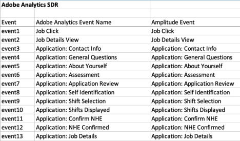

Amplitude offers a set of features, customization options, and scalability that provides a solid foundation for data-driven decision making. This guide explains the process, best practices, and key factors to consider as you transition your product analytics stack.

## Goals

This guide provides insights into the following, as you plan your migration:

### Data continuity and accuracy

- Ensure a smooth transition with minimal disruption to continuity.
- Guarantee the accuracy and consistency of analytics data in Amplitude.

### Efficient configuration and customization

- Replicate the custom configurations and custom reports you have in Adobe Analytics.
- Customize Amplitude to align with your organization's specific reporting needs and business requirements.
  
### User adoption and training

- Provide training on Amplitude to ensure a smooth transition for end-users.
- Provide clear communication to address user concerns and foster user adoption.

### Documentation and knowledge transfer

- Document the migration process, including configuration and troubleshooting procedures.
- Transfer knowledge to internal teams responsible for maintaining and using Amplitude.

### Compliance and governance

- Ensure compliance with data governance policies and regulatory requirements.
- Review and update privacy and consent policies to align with organizational policies.

### Integration

- Enable integration with other tools and platform that your organization uses.
- Validate and optimize the data flows between Amplitude and other business systems.

## Understand the differences in data models and top metrics

Adobe Analytics and Amplitude have different approaches to data modeling and tracking user interactions. Amplitude's data model focuses on events and properties. Adobe Analytics has different configurable data types like "hits" and custom metrics.

--8<-- "includes/adobe-data-model.md"

## Top metrics

Amplitude and Adobe Analytics use different terminology and structures for metrics. As a result, direct one-to-one mapping may not be possible. See the table below for a comparison of key metrics in Adobe Analytics and potential equivalents or comparable concepts in Amplitude.

| Term                               | Definition                                                               | Amplitude Equivalent                                                                                                                                                                                                                                                                   |
| ---------------------------------- | ------------------------------------------------------------------------ | -------------------------------------------------------------------------------------------------------------------------------------------------------------------------------------------------------------------------------------------------------------------------------------- |
| Page Views                         | The total number of times users view a page.                             | `PageView` event. Amplitude captures this by default, and you can pass it from any data source. See this [Community thread](https://community.amplitude.com/product-updates/default-event-tracking-as-part-of-our-browser-sdk-2-0-2462) for more information about autotracked events. |
| Unique Visitors                    | A count of the distinct visitors to a website or app.                    | Amplitude ID. Amplitude derives this from the User ID Count and Device ID Count.                                                                                                                                                                                                       |
| Events                             | Custom interactions or actions tracked on a website or app.              | Custom Events                                                                                                                                                                                                                                                                          |
| Conversion Rate                    | The percentage of visitors who complete a specified action.              | Conversion (tracked as a specific event). Build a [Funnel](https://help.amplitude.com/hc/en-us/articles/115001351507-Get-the-most-out-of-Amplitude-s-Funnel-Analysis-chart), which is a series of steps a user takes as part of the experience.                                        |
| Bounce Rate                        | Percentage of single-page sessions or visits.                            | Bounce Rate [session metric](https://help.amplitude.com/hc/en-us/articles/10442602260507-Use-session-metrics-to-evaluate-content-paths).                                                                                                                                               |
| Revenue / Transactions             | The total revenue generated or total number of transactions.             | Custom events for transactions and revenue.                                                                                                                                                                                                                                            |
| Conversion funnel metrics          | Metrics related to user progression through a defined conversion funnel. | [Funnel Analysis](https://help.amplitude.com/hc/en-us/articles/360052745632-Build-a-funnel-analysis)                                                                                                                                                                                   |
| Segmentation                       | The ability to segment data based on various criteria.                   | [Event Segmentation](https://help.amplitude.com/hc/en-us/sections/360011006171-Event-Segmentation) and User Properties.                                                                                                                                                                |
| Custom Variables (eVars and Props) | Custom variables used for segmentation and reporting.                    | Event Properties and User Properties.                                                                                                                                                                                                                                                  |

## Align on your top metrics and business use cases

Taking the time to align on your top business use cases makes it easier for your users to find useful reports and avoid higher future maintenance costs.

Before you start to migrate data, ensure all stakeholders and team members agree on what you want to get from the data. Consider the following:

### The top reports and analysis workspaces

To help understand the analysis workspaces you use most, use external tools that can read your Adobe configuration and provide a report. For example, a third-party [Component Editor](https://docs.datacroft.de/main-functions/the-component-editor-tab) can get workspace use statistics to help you understand which workspaces and projects are most active.

### Uses cases and critical metrics to focus on

Work with your top Adobe user and champions to confirm which key reports and KPIs they want to query in Amplitude. This allows you to define the data they need in Amplitude so you can focus on what's most important. These users build the reports and queries others use, so capturing their use cases and enabling them as change agents is beneficial to your migration.

For more information, see Amplitude's [industry-specific best practice guides](https://help.amplitude.com/hc/en-us/articles/115000465251-Data-planning-playbook#Next-Steps) for sample use cases and questions.

## Map your Adobe variables to the Amplitude schema

When you map variables from Adobe Analytics to Amplitude, you need to align the terminiology and concepts used in each platform. This table provides a general guide to map variables between Adobe Analytics and Amplitude. The mapping may not be one-to-one, and there may be differences in the way each platform collects and reports data. The specific configuration and setup of variables may vary based on the complexity of your analytics implementation.

| Adobe Analytics                 | Amplitude Analytics                                                                 | Notes                                                                                                                                                                                                                                                                                                                                                                                                                                                   |
| ------------------------------- | ----------------------------------------------------------------------------------- | ------------------------------------------------------------------------------------------------------------------------------------------------------------------------------------------------------------------------------------------------------------------------------------------------------------------------------------------------------------------------------------------------------------------------------------------------------- |
| Page Views                      | Event: PageView                                                                     | If you use Amplitude's Browser SDK, you can track Page Views with [default event tracking](/data/sdks/browser-2/#tracking-default-events). For users who want a more strategic taxonomy, Amplitude recommends that you identify the correct level of abstraction based on the page hierarchy and site map.                                                                                                                                              |
| Success/Custom Events           | Event                                                                               | Success Events map to Amplitude Events. [Custom Events](https://help.amplitude.com/hc/en-us/articles/16805886899483-Custom-events) in Amplitude are different from Custom Events in Adobe.                                                                                                                                                                                                                                               |
| Counter Success Event           | Event                                                                               |                                                                                                                                                                                                                                                                                                                                                                                                                                                         |
| Currency Success Event          | Event                                                                               | Currency and Numeric Success Events often map to special numeric and currency Event Properties in Amplitude. When you send Revenue/Purchase events to Amplitude, track specific revenue event properties prepended with a $. These event properties relate to the Purchase event. For more information, see [Track Revenue](https://help.amplitude.com/hc/en-us/articles/115003116888-Track-revenue#h_7a841611-ad4f-459a-98ce-073a4a1fe8e5).          |
| Numeric Success Event           | Event Property                                                                      | Currency and Numeric Success Events often map to special numeric and currency Event Properties in Amplitude. When you send Revenue/Purchase events to Amplitude, track specific revenue event properties prepended with a $. These event properties relate to the Purchase event. For more information, see [Track Revenue](https://help.amplitude.com/hc/en-us/articles/115003116888-Track-revenue#h_7a841611-ad4f-459a-98ce-073a4a1fe8e5).          |
| eVars (Conversion Variables)    | Event Properties or User Properties                                                 | You can send eVars as either User or Event Properties, depending on the use case. Decide which is more appropriate (for example, based on the context or how often the values change). To decide which is best, decide if the Adobe data variable relates to a user or the events the user is performing. Lastly, user property values can persist to subsequent events like eVars. Event property values don't persist to subsequent events. |
| Props (Traffic Variables)       | Event Properties                                                                    |                                                                                                                                                                                                                                                                                                                                                                                                                                                         |  |
| Visit                           | [Session](https://help.amplitude.com/hc/en-us/articles/115002323627-Track-sessions) |                                                                                                                                                                                                                                                                                                                                                                                                                                                         |  |
| Visitor ID                      | User ID                                                                             |                                                                                                                                                                                                                                                                                                                                                                                                                                                         |  |
| Visitor (Cross-Device Tracking) | Amplitude ID                                                                        | Amplitude ID is an ID that's used to identify a [particular user](https://help.amplitude.com/hc/en-us/articles/115003135607-Track-unique-users) across multiple User and/or Device IDs                                                                                                                                                                                                                                                                 |
| Conversion Variables            | Event Properties, Funnels                                                           |                                                                                                                                                                                                                                                                                                                                                                                                                                                         |
| Segments                        | Cohorts, Event Segmentation                                                         |                                                                                                                                                                                                                                                                                                                                                                                                                                                         |  |
| Instances                       | Count                                                                               |                                                                                                                                                                                                                                                                                                                                                                                                                                                         |  |
| Unique Visitors                 | User ID Count                                                                       |                                                                                                                                                                                                                                                                                                                                                                                                                                                         |  |
| Pathing                         | Funnel Analysis, Journeys                                                           |                                                                                                                                                                                                                                                                                                                                                                                                                                                         |  |
| Time Parting                    | Time-based Analysis, Custom Session Definition                                      |                                                                                                                                                                                                                                                                                                                                                                                                                                                         |  |

Once you understand how Amplitude collects data, the next step in migrating is to map your  current Adobe Analytics variable to Amplitude variables. Do this in a standard  spreadsheet. Most Adobe Analytics customers have a Solution Design Reference (SDR) that  lists all Success Events, eVars, and sProps. This Solution Design Reference spreadsheet can  map existing Adobe Analytics variables to Amplitude variables. 

To complete this exercise, add an extra column to each SDR tab and add the Amplitude event or property next to each existing Adobe Analytics variable you want to keep. Remember, Adobe Analytics Success Events map to Amplitude properties and that Adobe Analytics eVars and sProps map to Amplitude properties. 

For Amplitude properties, decide if the Amplitude property is an Event Property or a User Property as you map in the spreadsheet.

## Track real-time data with Amplitude

After you translate your Adobe schema into Amplitude's required data structure, create a [tracking plan](https://help.amplitude.com/hc/en-us/articles/5078731378203-Create-a-tracking-plan) document that outlines the events and properties to track, why you track them, and where you track them.

To create your Tracking Plan, go to the “Data” tab in your organization. If you instrument with Amplitude SDKs, Amplitude recommends that you use the [Ampli Wrapper](/data/sdks/ampli-overview/) which is a lightweight wrapper for the Amplitude SDK that provides type safety, supports linting, and enables features like input validation. Ampli CLI works together with the Ampli wrapper to bring a tracking library into your project.

## Select the data source and implementation method

After you decide which data elements you want to collect in Amplitude and create your Tracking Plan, the next step is to set up your Source and begin sending data into Amplitude.

Data collection is one of the most critical steps in any analytics program. For digital analytics products to succeed, they must consistently and accurately collect data as customers interact with digital properties. Most organizations have built a robust data collection layer that pushes data elements from websites and mobile apps to digital analytics products. Between the data layer and the digital analytics product there is often an intermediary that maps the raw data elements into data variables in the digital analytics product. 

This intermediary could be a Software Development Kit (SDK), JavaScript code, an Application Programming Interface (API), a Customer Data Platform (CDP), or a tag management system. Your organization likely has data collection tools in place for your existing Adobe Analytics implementation. Often, you can reuse those to send data to Amplitude.

Amplitude provides many [sources](/data/sources/) to help you collect and send data.

### Client-side sources

Use client-side sources in apps that your users run on their own devices, like mobile, web browser, and desktop apps. In these types of sources, code runs on the user's device.

Amplitude's client-side sources include these SDKs:

- Web: Browser, Marketing Analytics Browser, React Native
- Mobile: Android, iOS, Unity Plugin, Flutter, React Native
- Game engine: Unity Plugin, Unreal

For more information, see the [Analytics client-side SDK catalog](/data/sdks/sdk-overview/#analytics-client-side-sdks). 

### Server-side sources

Use server-side sources in secure, multi-user environments like web servers and services that you run on your own servers. In these sources, code runs on the server.

Amplitude's server-side sources include these SDKs and APIs:

- [HTTP API](/analytics/apis/http-v2-api)
- [Node.js SDK](/data/sdks/node)
- [Go SDK](/data/sdks/go)
- [Python SDK](/data/sdks/python)
- [Java SDK](/data/sdks/java)

For more information, see the Analytics server-side [SDK catalog](/data/sdks/sdk-overview/#analytics-data-server-side-sdks). 

### Third-party sources

For web-based data collection, you may have a data layer that works in combination with a tag management system. Popular tag management systems used by Adobe Analytics users include Adobe Launch, Tealium, and Google Tag Manager.

Amplitude has pre-built integrations with all these tag management systems. These  integrations allow you to use your organization’s existing data layer work to send data to Amplitude. Update existing tag management system rules to send data to Amplitude instead of Adobe Analytics.

#### Adobe Launch

If your organization uses Adobe Launch (Adobe’s tag management system) to populate Adobe Analytics data, Amplitude has an [Adobe Launch extension](https://exchange.adobe.com/apps/ec/108010)which you can use to send data to Amplitude. The Amplitude Adobe Launch extension is a wrapper for the Amplitude JavaScript SDK and allows your organization to use the existing data layer work that for Adobe Launch to send data to Amplitude.

!!!info "Adobe Launch availability"
    Adobe provides Adobe Launch free for Adobe clients, but if you eventually remove all Adobe products, you may lose access to Adobe Launch. The Amplitude Adobe Launch extension is a great way to try out Amplitude with little effort. But if your organization replaces Adobe Analytics, you may need to switch to another tag management system in the future.

#### Tealium

Amplitude integrates with Tealium IQ, Tealium’s enterprise tag management service.

Tealium IQ is a universal JavaScript library that creates a universal data object (UDO) for all elements of a page. This data is first sent to the data layer in Tealium, after which you can send it to third-party vendors (including Amplitude). 

There are two ways you can integrate Tealium iQ with your website: you can use Tealium's tag manager or their JavaScript library. For more information, including setup instructions, see [Integrate Tealium with Amplitude](/data/sources/tealium/).

#### Google Tag Manager

Amplitude provides [Analytics Google Tag Manager](/data/sources/google-tag-manager/#web-container) templates to collect data and offer a convenient way for developers to set up event tracking in their applications. These pre-configured templates provide a streamlined solution for deploying tracking tags, reducing the time and effort required to set up event tracking.

#### Segment

Amplitude offers two methods to integrate with Segment:

- Install Amplitude's SDKs and send data directly to Amplitude by client-side bundled integration.
- Set up a Segment destination and connect it with a Segment source.

For more information, see [Migrating from Segment to Amplitude](/guides/segment-migration-guide/).

#### mParticle

Learn more about mParticle’s integration with Amplitude [here](http://docs.mparticle.com/integrations/amplitude/event/).

## Send data downstream to destinations

Use [Amplitude Destinations](/data/destinations/) to send your data downstream to third-party platforms. This enables you to share data generated in Amplitude with other tools and stakeholders in a variety of contexts.

## Backfill historical data

When you migrate from Adobe Analytics, Amplitude recommends that you track new data moving forward.

If you need to send historical Adobe data, Amplitude recommends the following: 

- Determine if historical data is critical and necessary to answer your key business questions and metrics. Confirm the source to store historical data once Adobe is sunset. If possible, export this data to a warehouse, rather than Amplitude first.

- Key identifiers, data structures and user definitions can differ between Adobe Analytics and Amplitude. Given the complexity of unique identifiers in Adobe, it’s best to align on the logic for the main identifier for your unique visitors. The differences in the data models can lead to expected discrepancies on certain metrics. Amplitude recommends that you align on a percentage of discrepancies that's acceptable. 

- If you have a critical need to analyze historical data, Amplitude recommends that you confirm the specific events and properties that you consider to be critical. Migrating the full historical data set takes considerable time so rank specific events and properties your users are most likely to query in Amplitude. 

- To prevent issues with identity management due to the differences in the data model, Amplitude recommends that you backfill historical data into separate projects. If this data exists in a separate project, you may not be able to analyze trends over certain time periods. 

- In situations where historical data is essential, Amplitude recommends that you not exceed two years worth of data and usually the cut off time to be the last month before the complete set of data flows into Amplitude. For example, if you plan to start tracking data in your Production project starting on June 1, your backfilled dataset should end at the latest on May 31.
 
See the [Data Backfill Guide](/analytics/data-backfill-guide) for more instructions on backfilling data into Amplitude using the [Batch Event Upload API](/analytics/apis/batch-event-upload-api/).

### Migrate historical data to Amplitude

Here are the steps to migrate your historical data from Adobe to Amplitude:

1. Export your historical data to your data warehouse so you have a record of your Adobe Analytics data. Once exported, you can transform the data warehouse tables into the event and property models that Amplitude expects.
   1. Once your historical data is in a warehouse, you can use Amplitude’s [Data Warehouse sources](/data/sources/#warehouse) or the [Batch Event Upload API](/analytics/apis/batch-event-upload-api/) to import the re-formatted data into Amplitude. See the [Data Backfill Guide](/analytics/data-backfill-guide) for detailed instructions on backfilling data into Amplitude using the Batch Event Upload API.
   2. If your historical data is in Amazon s3 bucket, use Amplitude’s [Amazon S3 import](/data/sources/amazon-s3/) to backfill large amounts of data.
2. If your historical data is in a CDP, check to see if the CDP has a historical import feature. For example, Segment’s Replay feature can backfill historical data depending if it’s part of your organization’s plan.
3. If you need to migrate data directly from Adobe Analytics via Adobe’s [Data Feeds](https://experienceleague.adobe.com/docs/analytics/export/ftp-and-sftp/set-up-ftp-accounts/ftp-datafeeds.html?lang=en) feature, reach out to your Amplitude representative.

## Verify your data collection

Once you set up your Source and complete instrumentation, verify that the data is flowing into Amplitude and validate its quality. Here are some best practices as you send data to Amplitude:

- Always test your instrumentation: Amplitude recommends having a testing project for every production project in your organization. This gives you a reliable way to test your instrumentation before you send production data to Amplitude
- Amplitude can't retroactively change historical data: If your instrumentation is wrong, you can't clean up the data you collect later. See the steps below on how to QA your event data in Amplitude.

Data validation is a critical step in the instrumentation process. Amplitude lets you validate your event data with the following tools:

- [Ingestion Debugger](https://www.docs.developers.amplitude.com/data/debugger/#ingestion-debugger)
- [User Lookup](https://www.docs.developers.amplitude.com/data/debugger/#user-lookup)
- [Event Explorer Chrome extension](https://www.docs.developers.amplitude.com/data/debugger/#instrumentation-explorer)

### Ingestion debugger

Use the Ingestion Debugger in Amplitude to check your requests, events and identify counts, and throttled users or devices:

1. Log in to Amplitude.
2. Click Data in the top nav bar and select Source from the left nav bar.
3. Navigate to the Ingestion Debugger tab to access it.

The ingestion debugger has three charts that show data for successful requests, events and identify counts, and error requests for the endpoints you specify. You can specify a time range of either one hour or one week.

Below the ingestion debugger is the list of throttled users and devices. Here you can see a list of which users and device IDs have been throttled in the last 30 minutes, as well as a list of silenced device IDs.

### User lookup

After you instrument your events, you should manually send some of those events on your own device. After you have done so, follow these steps:

1. Navigate to the Users & Sessions tab in the nav bar at the top of Amplitude.
2. Navigate to the User tab to make sure you're viewing user-level details, and not account-level details.
3. Search by user ID, device ID, Amplitude ID, or user property values.

After you find your user profile, scroll down to the [Event Stream](https://help.amplitude.com/hc/en-us/articles/229313067#individual-event-stream) section. The event stream displays a user's entire event history, grouped by session. The most recent activity appears at the top of the list, and events populate the stream in ten seconds to one minute.

When you select an event, User Lookup provides detailed information about that event, including the user property and event property values at the time of that event.

Because the event stream can update in real-time, you can use it to make sure you capture new events correctly, or troubleshoot or debug instrumentation errors. For example, if you trigger an event only one time but the event stream consistently displays two instances of the event, then there could be an instrumentation error.

Click Raw  to see more information and the raw event data in JSON format

### Event explorer

The [Amplitude Event Explorer](https://chrome.google.com/webstore/detail/amplitude-event-explorer/acehfjhnmhbmgkedjmjlobpgdicnhkbp) is an extension in the Google Chrome Web Store that helps examine and debug your Amplitude Browser SDK instrumentation as you interact with your product. It captures each Amplitude event you trigger and displays it in the extension popup.

The extension supports Browser SDK or device-mode/client-side CDP/tag manager implementations.

In the Event Explorer, the Events tab is where you can find detailed insights into the parameters of each event you trigger on your website. This includes `user_id`, `device_id`, `event_properties`, and `user_properties`.

## Migrate users and replicate reports

After production data is flowing into the Amplitude project, you can create accounts for users and begin replicating reports and dashboards. 

To create Amplitude users, reference the Adobe Analytics user logs to see which users most often accessed Adobe Analytics. You can create these users in your organization’s settings in Amplitude.

If some essential reports or dashboards exist in Adobe Analytics, you can replicate them in  Amplitude. You can share these reports and dashboards with the same users who had access to them in Adobe Analytics, but you can use the third-party [Component Manager](https://docs.datacroft.de/) tool to extract this information. The tool also shows you popular Adobe Analytics segments and Calculated Metrics that you may wish to replicate in Amplitude.

For more information, these top charts that users most often replicate in Amplitude:

- [Data Tables](https://help.amplitude.com/hc/en-us/articles/6797483965083-Multi-dimensional-analysis-with-Data-Tables) - Most like Adobe Analysis Workspace. Allows you to conduct multi-dimensional analysis with metrics, events, and properties.
- [Funnel Chart](https://help.amplitude.com/hc/en-us/articles/115001351507-Get-the-most-out-of-Amplitude-s-Funnel-Analysis-chart) - Most like Adobe’s Funnel Visualization Report to measure conversion rates
- [Journeys](https://help.amplitude.com/hc/en-us/articles/231275508-The-User-Sessions-chart-Track-engagement-frequency-and-duration) - Allows you to analyze your customer journey and common paths users take. Most like Multi-Channel Funnel reports.
- [User Sessions](https://help.amplitude.com/hc/en-us/articles/231275508-The-User-Sessions-chart-Track-engagement-frequency-and-duration) - Allows you to analyze session data (“Visits”)
- [Metrics](https://help.amplitude.com/hc/en-us/articles/10249480038043-Create-a-metric) - Allow you to define and save reusable analysis objects and custom metrics
